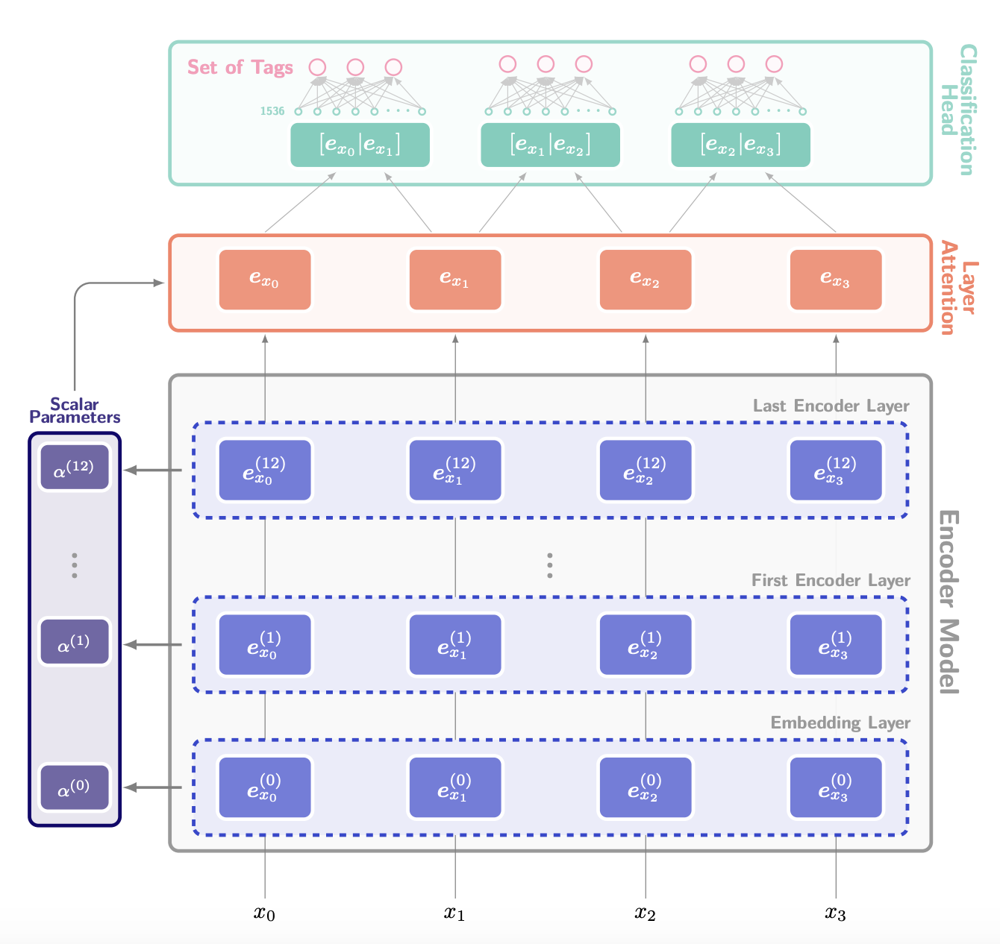

# Capitalisation And PuncTuatION (CAPTION)

> PT2020 Transcription project.

Code base used to participate in [1st Shared Task on Sentence End and Punctuation Prediction in NLG Text (SEPP-NLG 2021) held at SwissText 2021](https://sites.google.com/view/sentence-segmentation/)

## Shared task description:

Punctuation marks in automatically generated texts such as translated or transcribed ones may be displaced erroneously for several reasons. Detecting the end of a sentence and placing an appropriate punctuation mark improves the quality of such texts not only by preserving the original meaning but also by enhancing their readability.

The goal of the shared task is to build models for identifying the end of a sentence by detecting an appropriate position for putting an appropriate punctuation mark. Specifically, we offer the following subtasks:

- Subtask 1 (fully unpunctuated sentences-full stop detection): Given the textual content of an utterance where the full stops are fully removed, correctly detect the end of sentences by placing a full stop in appropriate positions.
- Subtask 2 (fully unpunctuated sentences-full punctuation marks): Given the textual content of an utterance where all punctuation marks are fully removed, correctly predict all punctuation marks. 

## Model architecture:



## Installation:

This project uses Python >3.6

Start by creating a virtual enviroment.

E.g:
```bash
virtualenv -p python3.6 punct3.6
source punct3.6/bin/activate
```

Finally run:
```bash
pip install -r requirements.txt
pip install -e .
```

## Getting Started:

### Train:
```bash
python cli.py train -f optuna-model.yaml
```

### Hyperparameter search:
```bash
python cli.py search -f optuna-model.yaml
```

### Testing:

Example on running inference for 'de':
```bash
mkdir data/pred/de/test
python cli.py test --model experiments/optuna-xlmr-large/ --language de --test
```

After running the above command you can look at the models predictions in the `data/pred/de/test/` folder. Also, you can run the oficial shared task evaluation script named: `evaluate_sepp_nlg_2021_subtask1.py`.

### Tensorboard:

Launch tensorboard with:
```bash
tensorboard --logdir="experiments/"
```

### Code Style:
To make sure all the code follows the same style we use [Black](https://github.com/psf/black).

